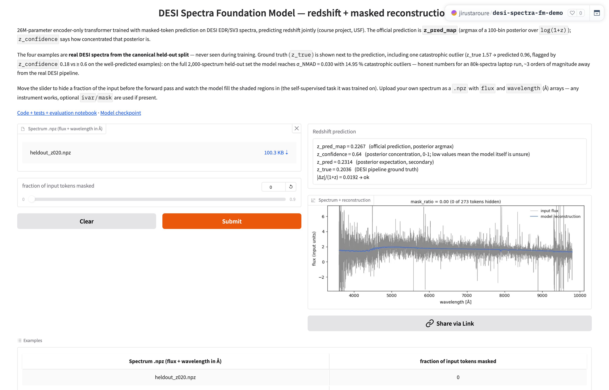
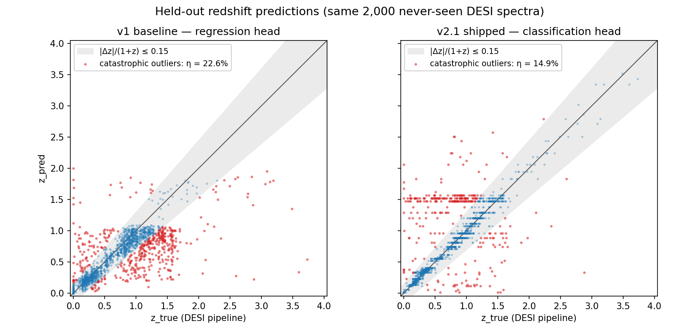

# DESI Spectra Foundation Model

[](https://github.com/Julian0444/desi-spectra-fm/actions/workflows/ci.yml)
[](https://huggingface.co/jirustaroure/desi-spectra-fm)
[](https://huggingface.co/spaces/jirustaroure/desi-spectra-fm-demo)
[](https://jirustaroure-desi-fm-api.hf.space/api/docs)

A 26M-parameter transformer trained **from scratch** with masked-token prediction on spectra
from the [DESI](https://www.desi.lbl.gov/) galaxy survey. Given a spectrum from **any
instrument**, it predicts the object's redshift — how much the expansion of the universe has
stretched its light, i.e. how far away it is — and reconstructs masked spectral regions.
Trained on a laptop; shipped as a public demo, a containerized REST API, and the engine of an
LLM agent.

**[▶ Live demo](https://huggingface.co/spaces/jirustaroure/desi-spectra-fm-demo)** ·
**[🤗 Model weights](https://huggingface.co/jirustaroure/desi-spectra-fm)** ·
**[📡 REST API](https://jirustaroure-desi-fm-api.hf.space/api/docs)** ·
**[🤖 LLM agent: spectra-copilot](https://github.com/Julian0444/spectra-copilot)** ·
**[📓 Evaluation notebook](notebooks/evaluation.ipynb)**

[](https://huggingface.co/spaces/jirustaroure/desi-spectra-fm-demo)

---

## Results: diagnosing and fixing a real failure mode

The v1 baseline predicted redshift with a scalar regression head — and regressed to the mean:
**22.6 % catastrophic outliers** on held-out data, a hard prediction ceiling at z = 2, and an
82.7 % failure rate exactly where quasars live (z ∈ [1.5, 2.5)). After diagnosing this with the
standard survey metrics (η, σ_NMAD, per-bin bias), the head was redesigned as a **100-bin
classification over log(1+z)** (with sqrt-inverse class weights from the real label histogram)
and v1 was fine-tuned into the shipped **v2.1**:



| metric (same 2,000 never-seen DESI spectra) | v1 baseline | **v2.1 (shipped)** |
|---|---|---|
| catastrophic outlier fraction η₀.₁₅ | 22.6 % | **14.95 %** |
| σ_NMAD (robust scatter) | 0.083 | **0.030** |
| mean |Δz| / (1+z) | 0.107 | **0.096** |
| η₀.₁₅ in z ∈ [1.5, 2.5) — the quasar band | 82.7 % | **23.5 %** |
| prediction ceiling (max z_pred) | 2.00 | **3.52** |
| masked-reconstruction RMSE (arcsinh space) | 0.819 | **0.817** |

Classification also buys a **calibrated confidence** for free: `z_confidence` (posterior
concentration) flags the predictions not to trust. Full progression, release gates and the
machine-readable promote decision: [DELIVERABLE.md](DELIVERABLE.md) §5 +
[`runs/desi_80k_classhead_v21/comparison.json`](runs/desi_80k_classhead_v21/comparison.json).

## The encoder is a foundation model, not just a z-head

`embed_spectrum()` mean-pools the encoder's valid spectral tokens into a 512-d vector. 15k
training spectra embedded and projected with UMAP, colored by their catalog redshift:


The model was never told to order spectra by redshift — the smooth gradient emerges from
masked-spectrum pretraining alone. These embeddings power a FAISS semantic-search index
([published on the Hub](https://huggingface.co/jirustaroure/desi-spectra-fm/tree/main/faiss))
used by the agent below.

## From model to product

Everything public, everything CI-tested (26 tests here, 35 in the agent repo):

- **[Live demo](https://huggingface.co/spaces/jirustaroure/desi-spectra-fm-demo)** (Gradio on
  HF Spaces) — real held-out spectra, interactive masking, upload your own `.npz`.
- **[REST API](https://jirustaroure-desi-fm-api.hf.space/api/docs)** (FastAPI + Docker) —
  `curl` a spectrum, get redshift + confidence back in ~1–3 s. [Details below](#rest-api-fastapi).
- **[spectra-copilot](https://github.com/Julian0444/spectra-copilot)** — an LLM agent (Claude
  API tool use) that treats this model as one instrument among several: it *physically
  verifies* predictions against known spectral lines, cross-checks them with FAISS
  nearest-neighbors, grounds its reasoning in a cited mini-RAG corpus (BM25; 0 hallucinated
  citations across all verified runs), and exposes the whole toolset as an **MCP server**.
- **[End-to-end evals](https://github.com/Julian0444/spectra-copilot#end-to-end-evals-does-verification-actually-help-n--150)**
  (n = 150 held-out spectra) with the honest headline: the bare model beats its own
  cheap-LLM agent (92.7 % vs 79.3 % within its protocol) — but the agent's self-reported
  confidence tracks accuracy monotonically, so a hybrid "agent only when confident" policy
  recovers 90.0 %. The eval caught a deployment-relevant failure the demos had hidden.

## Architecture

```
spectrum from any instrument (flux + wavelength, any units)
  → interpolate onto a log-λ grid (3600–9800 Å, 7081 px; out-of-coverage px marked invalid)
  → 273 patches × 26 px → linear projection → tokens (+ sinusoidal log-λ positions)
  → 8-layer transformer encoder (d_model = 512, 8 heads, 26 M params)
  → reconstruction head (per token)      → masked-region reconstruction, mapped back to your grid
  → redshift head (always-masked token)  → 100-bin posterior over log(1+z) → z + confidence
```

Because positions encode *physical wavelength* (not token index), spectra from instruments
with different coverage work out of the box — [details below](#how-it-handles-non-desi-spectra-ood).

**Stack:** PyTorch · Hugging Face Hub + Spaces · Gradio · FastAPI · Docker · GitHub Actions ·
FAISS · Claude API + MCP (agent repo).

## Quick start (3 commands)

```bash
python3 -m pip install -r requirements.txt && python3 -m pip install -e .
python3 -m pytest tests/ -q        # → 26 passed
CKPT=$(python3 -c "from huggingface_hub import hf_hub_download; print(hf_hub_download('jirustaroure/desi-spectra-fm', 'checkpoint_last.pt'))") \
  && python3 -m desi_fm.predict --checkpoint "$CKPT" --input YOUR_SPECTRA.npz --output predictions.npz
```

Python 3.9+, PyTorch 2.x (MPS / CUDA / CPU). Inference needs only NumPy + PyTorch;
`huggingface_hub` downloads the shipped v2.1 checkpoint once (~104 MB, cached). The tests
confirm the model loads, the forward pass works, the redshift mechanism is
information-leak-free, and the train/held-out split is disjoint and reproducible.

For the full evaluation with plots — metrics, bias/outlier analysis, reconstruction gallery,
training curves, live inference — open [`notebooks/evaluation.ipynb`](notebooks/evaluation.ipynb)
(ships pre-executed; sections 1–3 run offline from committed artifacts).

## How it was trained

Entirely on a MacBook (Apple MPS), streaming DESI EDR/SV3 spectra from the
[Multimodal Universe](https://github.com/MultimodalUniverse/MultimodalUniverse) dataset:

1. **v1** — masked-token pretraining + joint scalar z regression on the first 50k spectra.
2. **v2.1** — v1 fine-tuned on the first 80k spectra × 3 epochs with the classification head
   (cross-entropy normalized by log(n_bins), 1:1 loss weighting with reconstruction).
3. **Held-out** — the 2,000 valid-label spectra after the first 80k: never seen by either
   version, fixed membership, leak-free by construction (tested in CI).

Reproduce with `python3 -m desi_fm.train` — the exact flags of the shipped run are committed in
[`runs/desi_80k_classhead_v21/training_args.json`](runs/desi_80k_classhead_v21/training_args.json).

---

## Reference

Everything below documents the interfaces in detail (formats, APIs, layout, design rationale).

### Input format

`YOUR_SPECTRA.npz` is a NumPy `.npz` archive. **Required:**

| key | dtype | shape | meaning |
|---|---|---|---|
| `flux` | float32 | `(N, P)` or `(P,)` | observed flux, any units |
| `wavelength` | float32 | `(N, P)` or `(P,)` | wavelengths in Ångströms |

**Optional:**

| key | dtype | shape | meaning |
|---|---|---|---|
| `ivar` | float32 | `(N, P)` | inverse variance |
| `mask` | bool | `(N, P)` | `True` = bad / unusable pixel |

If `wavelength` is 1-D, the same grid is reused for every spectrum. A 1-D `flux` is treated as
a single spectrum.

### Output format

`predictions.npz` contains:

| key | shape | meaning |
|---|---|---|
| `z_pred_map` | `(N,)` | **official predicted redshift** (posterior argmax; classification checkpoints like v2.1) |
| `z_confidence` | `(N,)` | posterior concentration in [0, 1] (classification checkpoints) |
| `z_pred` | `(N,)` | posterior-expectation redshift (backward compatibility; the only prediction for v1) |
| `reconstruction_input_grid` | `(N, P)` | reconstruction on your wavelength grid, in your flux units |
| `reconstruction_model_grid` | `(N, 7081)` | reconstruction on the model's internal log-λ grid |
| `model_wavelength` | `(7081,)` | the model's internal wavelength grid (3600–9800 Å, log-spaced) |
| `spectrum_mask` | `(N, 273)` bool | which of the 273 token positions were masked |
| `center`, `scale` | `(N,)` | per-spectrum normalization stats applied internally |

### Reconstruction-benchmark mode

By default the model receives the full input spectrum and is asked to predict `z`. To benchmark
**masked-region reconstruction**, pass `--mask-ratio` to randomly mask that fraction of the 273
token positions before the forward pass:

```bash
python3 -m desi_fm.predict \
    --checkpoint "$CKPT" \
    --input  YOUR_SPECTRA.npz \
    --output predictions.npz \
    --mask-ratio 0.5
```

`spectrum_mask` in the output tells you exactly which 26-pixel patches were hidden, so you can
compute reconstruction error against ground truth on those regions only.

### Python API

```python
import numpy as np
from huggingface_hub import hf_hub_download
from desi_fm.predict import predict_spectrum, predict_spectra_batch, embed_spectrum

ckpt = hf_hub_download("jirustaroure/desi-spectra-fm", "checkpoint_last.pt")

# Single spectrum
result = predict_spectrum(
    flux=flux_1d,
    wavelength=wavelength_1d,
    ivar=optional_ivar,
    mask=optional_bad_pixel_mask,
    checkpoint_path=ckpt,
)
z = result["z_pred_map"]                        # official prediction (v2.1)
conf = result["z_confidence"]                   # posterior concentration [0, 1]
recon  = result["reconstruction_input_grid"]    # same shape as flux_1d

# Batch of N spectra
batch = predict_spectra_batch(
    fluxes=fluxes_2d,                # (N, P)
    wavelengths=wavelengths,         # (N, P) or (P,)
    checkpoint_path=ckpt,
)
batch["z_pred_map"]                  # (N,) official prediction
batch["reconstruction_input_grid"]   # (N, P)

# Embedding (the encoder as a representation model)
emb = embed_spectrum(flux=flux_1d, wavelength=wavelength_1d, checkpoint_path=ckpt)
emb.shape                            # (512,) — mean-pooled valid spectral tokens
```

### REST API (FastAPI)

**Public endpoint** — a free HF Space serving `desi_fm.api` (CPU inference; a request takes
~1–3 s, but the first one after idle may take ~30 s while the Space wakes up):

```bash
# health check
curl -s https://jirustaroure-desi-fm-api.hf.space/api/healthz

# redshifts for every spectrum in a .npz (flux + wavelength, optional ivar/mask)
curl -s -F "file=@spectrum.npz" \
  "https://jirustaroure-desi-fm-api.hf.space/api/predict?mask_ratio=0.0"
# → {"n": 1, "z_pred_map": [0.2267], "z_confidence": [0.6376], "z_pred": [0.2314]}

# a single spectrum as JSON lists
curl -s -X POST https://jirustaroure-desi-fm-api.hf.space/api/predict_json \
  -H "Content-Type: application/json" \
  -d '{"flux": [/* P floats */], "wavelength": [/* P Angstroms */]}'
```

Interactive Swagger docs: **<https://jirustaroure-desi-fm-api.hf.space/api/docs>**.
As everywhere in this project, the official prediction is `z_pred_map` (with its
`z_confidence`); `z_pred` is the secondary posterior mean. Limits: 32 spectra / 50 MB per
request.

**Run it yourself:**

```bash
pip install -e ".[api]"
uvicorn desi_fm.api:app --port 7860      # checkpoint auto-downloads from the Hub

# or containerized:
docker build -t desi-fm-api .
docker run -p 7860:7860 desi-fm-api
```

Set `DESI_FM_CKPT=/path/to/checkpoint_last.pt` to serve a local checkpoint instead of
downloading. The deployed Space source is in [`api/`](api/) — a ZeroGPU *Gradio* Space wrapping
the same FastAPI app (REST calls run on CPU and spend no ZeroGPU visitor quota).

### How it handles non-DESI spectra (OOD)

Positional information inside the model is **a sinusoidal embedding of physical `log(λ)`**, not
an arbitrary token index. So when a non-DESI spectrum arrives:

1. It is interpolated onto the model's internal `log(λ)` grid (3600–9800 Å, 7081 pixels).
2. Pixels outside the new instrument's wavelength coverage are marked `valid=0` so the model
   knows to ignore them.
3. The transformer reads the remaining valid tokens. Each token "knows" the physical wavelength
   it represents.
4. The reconstruction is interpolated back to the caller's grid in original flux units.

This is transparent to the caller — just pass any `(flux, wavelength)` arrays to `predict.py`.

### Repository layout

```
src/desi_fm/
  model.py            transformer encoder + reconstruction & redshift heads
  data.py             spectrum preprocessing (interpolation, normalization, patching)
  train.py            training loop
  evaluate.py         validation metrics on DESI streaming data
  predict.py          instrument-agnostic inference  ← use this for benchmarking
  api.py              FastAPI REST API (/predict, /predict_json, /healthz)
  inspect_schema.py   sanity-check utility for the MMU/DESI dataset
tests/                26 unit tests (shapes, no-leakage, split isolation, calibrated loss, MAP outputs, embeddings, API)
demo/                 Gradio app deployed to the live HF Space (jirustaroure/desi-spectra-fm-demo)
api/                  API app deployed to the live HF Space (jirustaroure/desi-fm-api)
Dockerfile            CPU-only container image for the REST API
scripts/
  make_demo_examples.py    exports the demo's real held-out example spectra
  estimate_z_histogram.py  estimates the training-label histogram (v2.1 class weights)
  plot_scatter_v1_v2.py    regenerates the README's v1-vs-v2.1 held-out scatter
notebooks/
  evaluation.ipynb            ready-to-run evaluation notebook for v2.1 (metrics, plots, live demo)
  evaluation_v1_baseline.ipynb  the executed v1 "before" picture (bias/outlier diagnosis)
runs/desi_80k_classhead_v21/
  checkpoint_last.pt        the shipped model — v2.1 fine-tune of v1 (26 M parameters)
                            (not in git — download from hf.co/jirustaroure/desi-spectra-fm)
  config.json               model configuration
  training_args.json        exact training flags of the run
  metrics.jsonl             per-step training metrics
  predictions.csv           held-out predictions on 2000 DESI spectra (z_pred_map official)
  reconstructions.npz       held-out reconstructions on 50 DESI spectra
  comparison.json           v1 ↔ v2.1 release gates + promote decision
runs/calibration/
  predictions_v1_heldout_canonical.csv   the v1 baseline on the same held-out split
DELIVERABLE.md        full deliverable documentation (architecture, decisions, metric progression)
README.es.md          Spanish development walkthrough · RESUMEN.md project summary · COMO_FUNCIONA.md code walkthrough
```

### Design summary (one paragraph)

Encoder-only transformer (8 layers, `d_model=512`, 8 heads, 26 M parameters) trained with
masked-token prediction on DESI EDR/SV3 spectra. Each spectrum is interpolated onto a log-λ
grid, sliced into 273 continuous patches of 26 pixels, linearly projected to token embeddings,
and augmented with a 274th always-masked redshift token. A sinusoidal log-λ positional
embedding is added so the model can be applied to spectra from instruments with different
wavelength coverage. Both redesign approaches from the specification are implemented: a
lightweight MLP redshift head trained jointly with the encoder (Approach A), and the redshift
token forcibly masked on every training example (Approach B). The v1 checkpoint (50 k spectra)
used a scalar SmoothL1 regression on `log(1+z)`; the shipped **v2.1 checkpoint fine-tunes v1**
on the first 80 k spectra × 3 epochs with a **100-bin classification head over `log(1+z)`** —
cross-entropy normalized by `log(n_bins)`, sqrt-inverse class weights from the real
training-label histogram, 1:1 loss weighting with reconstruction, and a leak-free
train/held-out split — which removes the regression-to-the-mean collapse and the z ≈ 2
prediction ceiling diagnosed in v1. Full design rationale and oral-question answers are in
[DELIVERABLE.md §4–5](DELIVERABLE.md).

### Troubleshooting

| symptom | fix |
|---|---|
| `RuntimeError: MPS backend …` | add `--device cpu` (slower but works on every machine) |
| `KeyError: 'flux'` | input `.npz` must contain at least `flux` and `wavelength` arrays |
| `RuntimeError: shape mismatch` | check that `flux` and `wavelength` have the same shape |
| inference seems slow | the batch API loops per spectrum; expect a few hundred ms per spectrum on MPS, ~1 s on CPU |

### Academic context

Built as the final project for PHYS303 / CS486 / CS686 (University of San Francisco) by
**Julian Irusta Roure**; the redshift mechanism was redesigned per the project specification
after TA feedback flagged the v1 bias/outlier problem — the diagnosis and fix are the
[Results](#results-diagnosing-and-fixing-a-real-failure-mode) story above. Full grader-facing
documentation: [DELIVERABLE.md](DELIVERABLE.md). Spanish-language walkthroughs:
[README.es.md](README.es.md), [RESUMEN.md](RESUMEN.md), [COMO_FUNCIONA.md](COMO_FUNCIONA.md).

### References

- Project specification: PHYS303/CS486 final project (USF) — build and evaluate a
  self-supervised foundation model for DESI spectra with redshift prediction (course material,
  not distributed in this repo)
- Multimodal Universe dataset: <https://github.com/MultimodalUniverse/MultimodalUniverse>
- AION-1 (reference, not reproduced): <https://github.com/PolymathicAI/AION>
- AION-1 checkpoints (not used at inference time): <https://huggingface.co/polymathic-ai/aion-base>
